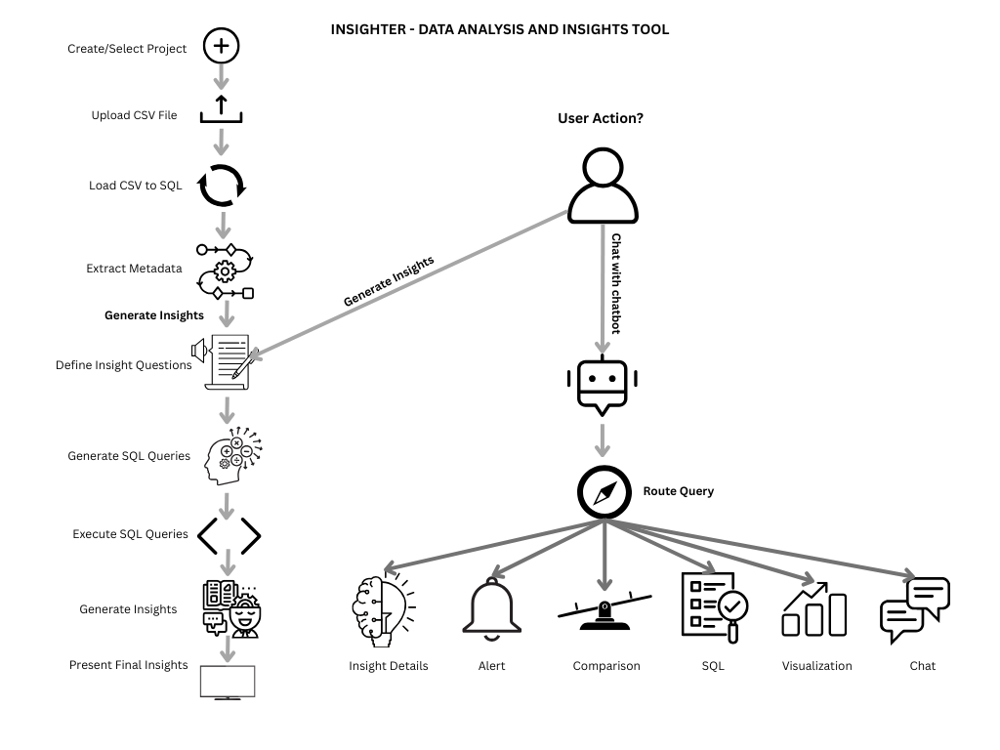

# Insighter - Data Analysis And Insights Tool

A data analysis and insights generation tool built with Streamlit.



---

## Project Structure

```
insighter/
├── components/     # UI components
├── config/         # Configuration files
├── data/           # Data files and database
├── models/         # AI models and prompts
├── pages/          # Application pages
├── pipelines/      # Data processing pipelines
├── styles/         # CSS and styling
└── utils/          # Utility functions
```

---

## Installation

```bash
pip install -r requirements.txt
```

---

## Running The Application

```bash
streamlit run app.py
```

---

## Development

- The application uses Streamlit for the frontend.
- Data is stored in a SQLite database and CSV files.
- AI insights are generated using custom pipelines.
- There are two main pipelines in this project:
  - **Data Insight Extraction Pipeline:**  
    Loads the uploaded CSV into an in‑memory SQLite database, extracts metadata, defines insight questions, generates SQL queries, executes them, creates insights from the results, and presents the final output.
  - **Chatbot Pipeline:**  
    Allows users to interact with the system using natural language. It routes queries and determines the appropriate action (e.g., run SQL, create alerts, generate visualizations, compare insights, provide details, or casual chat), then returns the result accordingly.

---

## About The Project

Insighter is designed to be an intuitive and efficient tool for analyzing structured data and extracting valuable insights. Users can upload datasets, generate insights automatically, and interact with a chatbot to explore the data further. It’s ideal for data analysts, business users, and developers who want to gain value from their data without writing complex code.

---

